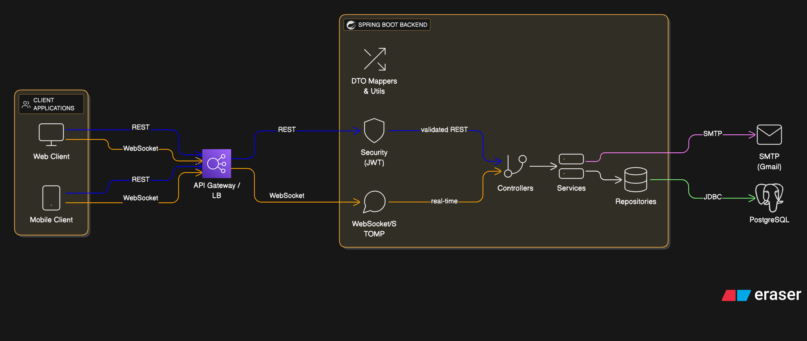

# Social Media App Backend



A production-ready Spring Boot backend that powers a social platform for like-minded people. It offers secure authentication, rich content sharing (posts, reels, stories, comments), real-time chat via WebSockets, notifications, and email-driven password recovery on top of a PostgreSQL database.

## Highlights

- JWT-secured authentication with role-based access.
- Rich media interactions: posts, comments, stories, reels, and threaded chats.
- Group and direct messaging with live updates through STOMP/WebSocket.
- Email-based password reset using Gmail SMTP (pluggable with any provider).
- Modular service/repository layers with DTO mappers for clean responses.
- Ready for cloud DBs (Render/Neon) or local PostgreSQL/MySQL.

## Tech Stack & Libraries

- **Language/Runtime:** Java 17
- **Framework:** Spring Boot 3.1.4 (`spring-boot-starter-web`, `spring-boot-starter-data-jpa`, `spring-boot-starter-security`, `spring-boot-starter-validation`, `spring-boot-starter-websocket`, `spring-boot-starter-mail`)
- **Persistence:** Spring Data JPA, Hibernate, PostgreSQL driver (`org.postgresql:postgresql`)
- **Auth:** JSON Web Tokens (`io.jsonwebtoken:jjwt-*`)
- **Utilities:** Lombok (DTOs/entities), Spring DevTools
- **Build Tool:** Maven Wrapper (`mvnw`)
- **Testing:** `spring-boot-starter-test`, `spring-security-test`

## Project Structure (key paths)

```
src/main/java/com/zosh/
├── config/           # Security, JWT, CORS, WebSocket config
├── controller/       # REST endpoints (auth, posts, chat, reels, etc.)
├── dto/mapper/       # DTO records + mappers
├── exception/        # Custom exception hierarchy
├── model/            # JPA entities (User, Post, Story, Chat…)
├── repository/       # Spring Data repositories
├── service/          # Business logic implementations
└── utils/            # Helper utilities (chat/post helpers)
src/main/resources/
└── application.properties  # Port, DB, SMTP config
```

## Prerequisites

- Java 17 (e.g., `brew install openjdk@17` and add to `PATH`)
- Git
- PostgreSQL 13+ (local or hosted). MySQL can be used by switching the commented config + dependency.
- Optional: Maven (the wrapper `./mvnw` already ships in the repo)

## Getting Started

1. **Clone**
   ```bash
   git clone <your-fork-or-origin-url>
   cd Social_Media_APP_Backend-main
   ```

2. **Configure secrets**
   - Copy `src/main/resources/application.properties` to an `.env` or override via environment variables.
   - Set `spring.datasource.*` to your DB host/user/password.
   - Set `spring.mail.*` to a valid SMTP account (prefer app passwords).
   - NEVER commit real passwords/API keys—use environment variables or Spring Cloud Config.

3. **Install dependencies / build**
   ```bash
   chmod +x mvnw                         # one-time, macOS/Linux
   ./mvnw clean install                  # downloads all libraries + runs tests
   # or fetch deps without executing tests:
   ./mvnw dependency:go-offline
   ```

4. **Run the app**
   ```bash
   # hot reload mode
   ./mvnw spring-boot:run

   # or build an executable jar
   ./mvnw clean package -DskipTests
   java -jar target/zosh-social-0.0.1-SNAPSHOT.jar
   ```

   The API listens on `http://localhost:5454` by default (configured via `server.port`).

## Configuration Notes

- **Database**  
  Default profile points to a Render-hosted PostgreSQL instance:

  ```
  spring.datasource.url=jdbc:postgresql://dpg-d1f6np9r0fns73chmc5g-a.oregon-postgres.render.com:5432/zosh_social?sslmode=require
  spring.datasource.username=zosh_social_owner
  spring.datasource.password=...
  spring.jpa.hibernate.ddl-auto=update
  ```

  Replace with your own credentials for local development. For MySQL, uncomment the MySQL block in `application.properties` and re-enable the `mysql-connector-j` dependency in `pom.xml`.

- **Email**  
  Uses Gmail SMTP (`spring-boot-starter-mail`). Update the username/password to a secure app password or switch to a different SMTP provider.

- **Security/JWT**  
  JWT secrets and expiration times are defined in `com.zosh.config.JwtConstant`. Override via environment variables before production.

- **WebSockets**  
  STOMP endpoints and SockJS fallbacks are configured in `WebSocketConfig`, enabling `/ws` for real-time chat updates.

## Useful Commands

| Task | Command |
|------|---------|
| Build & test | `./mvnw clean verify` |
| Run with devtools | `./mvnw spring-boot:run` |
| Package jar | `./mvnw clean package -DskipTests` |
| Execute packaged app | `java -jar target/zosh-social-0.0.1-SNAPSHOT.jar` |
| Run unit tests only | `./mvnw test` |
| Generate dependency tree | `./mvnw dependency:tree` |
| Lint/format (if added) | integrate via `spotless`/`checkstyle` plugins |

## Feature Modules & Endpoints (high level)

- **Auth & Users**: register/login, JWT issuance, profile updates (`AuthController`, `UserController`).
- **Posts & Comments**: CRUD operations, likes, comment threads (`PostController`, `CommentController`).
- **Stories & Reels**: ephemeral content APIs (`StoryController`, `ReelsController`).
- **Chats & Messages**: single/group chat creation, message send, live websocket feed (`ChatController`, `MessageController`, `RealTimeChat`).
- **Notifications & Password Reset**: email tokens, reset flow (`ResetPasswordController`, `PasswordResetTokenService`).

Refer to the controller package for specific endpoint mappings and request payloads.

## Testing

```bash
./mvnw test
```

Add more unit/integration tests under `src/test/java/com/zosh/` as you expand functionality.

## Deployment Tips

- Externalize configuration via environment variables or Spring Config Server.
- Use managed PostgreSQL (Render, Neon, RDS) and provide SSL parameters (`sslmode=require`).
- Behind a reverse proxy/load balancer, ensure WebSocket upgrades are allowed.
- Add containerization (Dockerfile/docker-compose) for easier CI/CD if needed.

## Contributing

1. Fork the repo & create a feature branch.
2. Ensure new code passes `./mvnw clean verify`.
3. Submit a PR describing the feature/fix and testing performed.

---

Happy building! Let me know if you need API docs, Postman collections, or Docker setup instructions.


